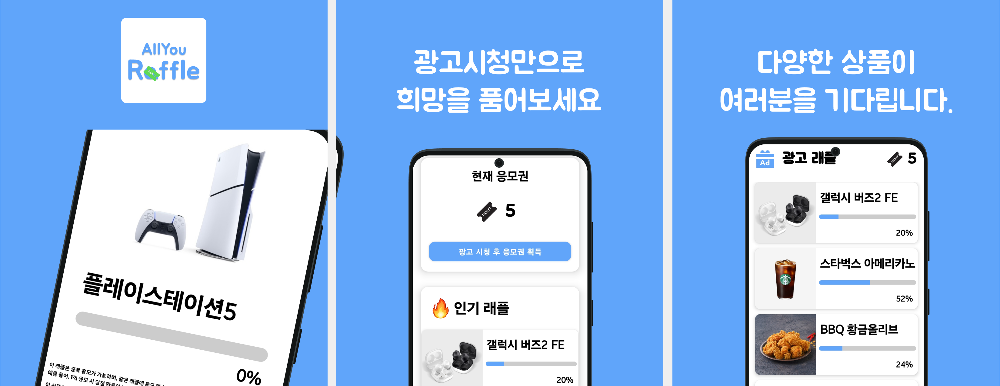
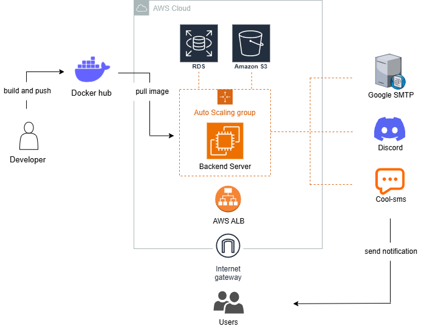
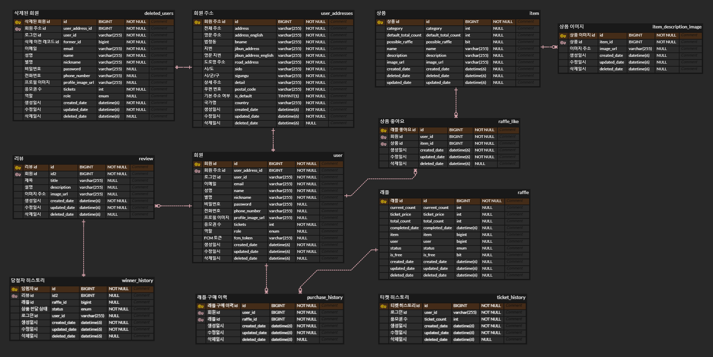

# 상품 추첨 서비스

## 프로젝트 기간
- 2024.07.27 ~ 2024.10.15

## 팀원 구성
|                                       **김시환**                                        |                                        **박성찬**                                         |
|:------------------------------------------------------------------------------------:|:--------------------------------------------------------------------------------------:|
|                                  순서와 정합성을 보장하는 응모 서비스 구현                             |                               쿼리 최적화, 이상치 탐지를 위한 api 작성                                |
|  |  |

## 배포 아키텍처

## ERD

## 기술 스택 및 도구
| Category              | Technologies                                  |
|----------------------|------------------------------------------------|
| Backend             | Kotlin, Spring Boot, Spring Security            |
| Database            | MySQL, JPA, QueryDSL                            |
| Testing & Benchmarking | JUnit5, fixtureMonkey, k6                    |
| DevOps & Cloud      | AWS                                             |
